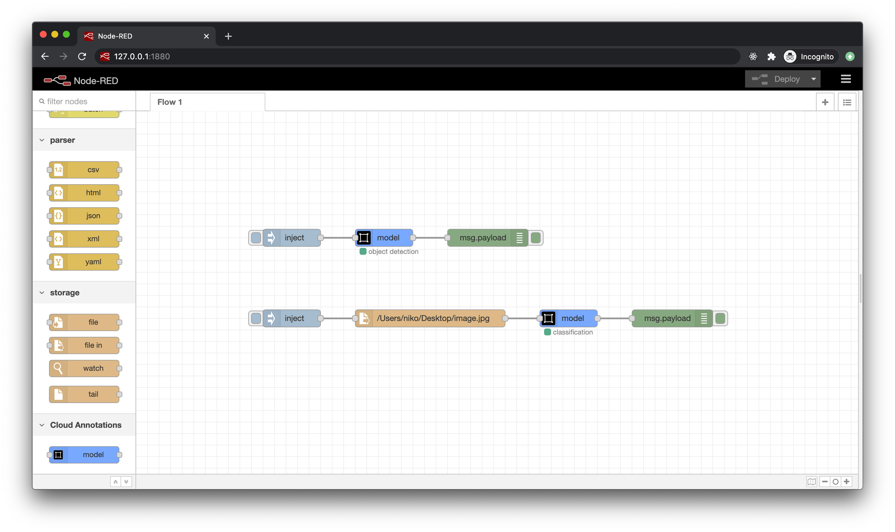

# node-red-contrib-cloud-annotations-gpu

[](http://www.npmjs.org/package/node-red-contrib-cloud-annotations-gpu)
[](https://david-dm.org/cloud-annotations/node-red-contrib-cloud-annotations-gpu)

A [Node-RED](http://nodered.org) node for making predictions with Cloud Annotations models.



## Install

If you plan to use this Node-RED node on a Nvidia Jetson Nano, follow these [official TensorFlow 1.x release instructions for Jetson Nano](https://forums.developer.nvidia.com/t/official-tensorflow-for-jetson-nano/71770) before installing this node.

Run the following command in your Node-RED user directory - typically `~/.node-red`:

```
npm install node-red-contrib-cloud-annotations-gpu
```

You will notice that npm installs a ```@cloud-annotations/models-node-gpu``` dependency. That package requires a dependency on ```@tensorflow/tfjs-node-gpu```
After a lengthy build process, it will download a set of libtensorflow*.so libraries.

If you are running on a Jetson Nano, that's where the Nvidia Jetson package installed initially becomes important. You may need to copy the libtensorflow.so and libtensorflow_framework.so from the Nvidia Jetson python package to
```~/.node-red/node_modules/@tensorflow/tfjs-node-gpu/deps/lib```

## Usage

Feed the model an image and get a list of predictions.


### Configuration

- `Model path`: The path to the Cloud Annotations model.


### Input

- `msg.payload`: The payload can either be a string path to an image file or a buffer object holding the image bytes.

### Output

- `msg.payload`: A list of predictions.

The prediction array varies depending on the type of model loaded.

Object detection model example:
```js
[{
  label: 'dog',
  bbox: [
    330.9269714355469, // x coordinate
    281.0324728488922, // y coordinate
    374.56329345703125, // width
    550.1768910884857 // height
  ],
  score: 0.92
},
{
  label: 'cat',
  bbox: [
    1168.9867401123047, // x coordinate
    431.68705701828003, // y coordinate
    412.3546600341797, // width
    522.2745037078857 // height
  ],
  score: 0.72
}]
```

Classification model example:
```js
[
  { label: 'dog', score: 0.92 },
  { label: 'cat', score: 0.72 }
]
```
